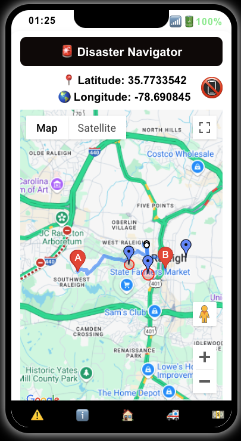

### **📍 AI-Powered Disaster Navigation App**
**🏆 Built at Hack_NCState**  




#### **🚨 Overview**  
Natural disasters often leave people **struggling to find safe routes**, locate shelters, and make quick evacuation decisions—especially when communication networks are unreliable. Inspired by recent events like the **LA wildfires**, our team developed an **AI-powered Disaster Navigation App** that provides **real-time and offline emergency routing**, guiding users to safety while **avoiding danger zones**.  

---
🔗 **Live Demo:** [View Here](https://dreamy-blini-fdb9b1.netlify.app/)

**NOTE:** For better performance try in Android or Chrome based browsers.

---

## **🌟 Features**  

✅ **📡 Emergency Alert Parsing** – AI extracts shelter coordinates from **broadcast alerts and SMS messages**.  
✅ **🛣️ Smart Route Optimization** – Uses **Google Maps API with custom waypoints** to **dynamically reroute** around blocked roads and disaster zones.  
✅ **📶 Offline Mode** – Pre-caches maps and routes, allowing navigation **without internet access**.  
✅ **🤖 AI-Generated Prevention Plans** – Provides **personalized safety recommendations** based on the user’s location and disaster type.  
✅ **🚑 Relief Agency Support** – Enables **first responders** to efficiently navigate directly to danger zones for rescue operations.  

---

## **🛠️ Tech Stack**  

| Technology     | Purpose |
|---------------|---------|
| **React.js**  | Frontend development |
| **Google Maps API** | Route optimization & navigation |
| **AI (GenAI & NLP)** | Extracting shelter coordinates from messages |
| **Geolocation API** | Fetching user location |
| **Local Storage / Caching** | Offline navigation support |
| **Twilio / SMS API (Future Plan)** | Real-time emergency alerts integration |

---

## ⚙️ How It Works  

1️⃣ User receives an emergency broadcast or SMS with shelter details.  
2️⃣ Our AI extracts shelter coordinates from the message.  
3️⃣ Google Maps API generates the safest route while avoiding danger zones.  
4️⃣ If offline, the app uses pre-saved maps to guide users.  
5️⃣ AI gives personalized prompts based on disaster type and user location.  
---

## **🚀 Installation & Setup**  

1️⃣ Clone the repository:  
```bash
git clone https://github.com/varundeepakgudhe/Hack_NC_25.git
cd disaster-navigation
```
2️⃣ Install dependencies:  
```bash
npm install
```
3️⃣ Add your **Google Maps API key** in `.env`:  
```env
REACT_APP_GOOGLE_MAPS_API_KEY=your_api_key_here
```
4️⃣ Run the app locally:  
```bash
npm start
```
---

## **🚀 Running the Disaster Navigation App with Docker**
This project is fully containerized with **Docker**! You can run it in two ways:

### **1️⃣ One-Time Run (Using Command Line)**
If you want to run the app **without modifying files**, use this command:  
```sh
docker run -p 3000:3000 \
  -e REACT_APP_GOOGLE_MAPS_API_KEY="your-google-maps-api-key" \
  -e REACT_APP_OPENAI_API_KEY="your-openai-api-key" \
  varundeepakgudhe/disaster-navigation
```
🔹 **This will start the app immediately!**  
🔹 Replace `"your-google-maps-api-key"` and `"your-openai-api-key"` with actual values.  

---

### **2️⃣ Persistent Setup (Using `.env` and Docker Compose)**
If you **don’t want to enter API keys every time**, follow these steps:

#### **📌 Step 1: Create a `.env` file** (in the same directory as `docker-compose.yml`):
```txt
REACT_APP_GOOGLE_MAPS_API_KEY=your-google-maps-api-key
REACT_APP_OPENAI_API_KEY=your-openai-api-key
```

#### **📌 Step 2: Create a `docker-compose.yml` file**:
```yaml
version: "3.8"
services:
  react-app:
    image: varundeepakgudhe/disaster-navigation
    ports:
      - "3000:3000"
    env_file:
      - .env
```

#### **📌 Step 3: Run the app**
```sh
docker-compose up
```
🔹 **Now the app automatically loads API keys from `.env`**  
🔹 No need to enter keys every time! 🎉 

---

## **📌 Notes**
✅ **Make sure Docker is installed** before running these commands.  
✅ This app runs on **`http://localhost:3000`** by default.  
✅ **To stop the container**, press `Ctrl + C` or run `docker stop <container_id>`.  

---

## **📝 Challenges We Faced**  

🔹 **Dynamically avoiding danger zones** using Google Maps API required fine-tuning **waypoints**.  
🔹 **Extracting coordinates from emergency messages** with AI needed NLP optimization.  
🔹 **Balancing real-time and offline functionality** for disaster scenarios was crucial.  
🔹 **Crafting effective AI prompts for GenAI using the Gemini model** while accurately fetching relevant data from MongoDB was challenging. 

---

## **🎯 Future Enhancements**  

<li>Smart Insurance Policy Recommendations and Claim Assistance</li>
<li>Community-Driven & Government Collaboration</li>
<li>Crowdfunding & Donations for Disaster Relief</li>
<li>Volunteer Matching to Shelters and Disaster zones </li>

---

## **📢 Team & Acknowledgments**  

💡 **Built at Hack_NCState** 🏆 

💻 Developed by **Varun Deepak Gudhe**, **Mugdha Joshi**, **Soubhagya Akkena**, **Jahnavi Panchavati.**  

🙏 Thanks to **Hack_NCState organizers** for an incredible hackathon experience! Checkout our [Devpost](https://devpost.com/software/disasternavigator?ref_content=user-portfolio&ref_feature=in_progress)

🚀 **Let’s make disaster preparedness smarter and safer for everyone.**  

